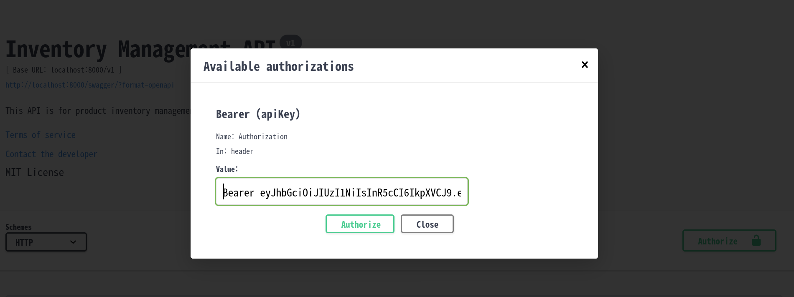

# Summary
This is a inventory management APIs that are accessed by user levels. There are two groups of user levels. The first group is Manager who is able to alter inventory data and the second group is Customer who is only able to enter the inventory data.

# Features
- Docker
- Django
- Django Rest Framework
- Authentication endpoints
- Testing base

# Install
There are two ways of setting up dev environment. If you opt docker, the system requisites are docker and docker-compose. If you prefer to pipenv, pipenv installation is required.

1) `make setup` (or run the setup commands in Makefile if you don't have make installed.)

## For docker user

1) `make makemigrations`
2) `make migrate`
3) `make run`

## For pipenv user

1) `pip install pipenv`
2) `make dev-makemigrations`
3) `make dev-migrate`
4) `make dev-run`

## Running tests
You can run tests with `make test` or `make dev-test`.

# Usage

## For API Docs

http://localhost:8000/v1/docs/

## For API Test with swagger UI

http://localhost:8000/swagger/

## API Test Steps using swagger

### User Register

You can add user information in the next screen.

You can see the result of your request.

### User Login to obtain JWT

### JWT Authorizations

You need to set `Bearer {JWT}` in the screen. {JWT} can be obtained from Login Response.

### Item Update Test

### Order Test

##### Running django commands
Since the project is running in a docker container you can run django commands
with `docker-compose exec django ./manage.py <command>`.

##### Owning files
When generating new files through `startapp` or `makemigrations` for instance, the files will not be owned by you and you won't have permission to modify. You can fix that by running `make chown`.
